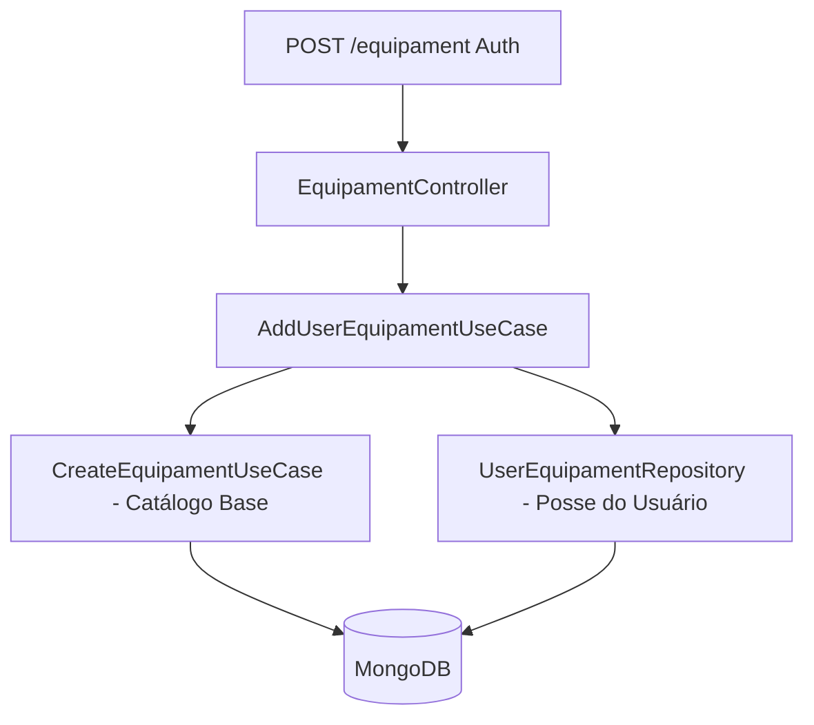

# Módulo: Equipament (Equipamentos de Café)

Este módulo gerencia o catálogo base de equipamentos e a posse personalizada de cada usuário.

## Regras de Negócio

- **Criação In-place**: `POST /equipament` cria simultaneamente o registro no catálogo (`Equipament`) e o registro de posse do usuário (`UserEquipament`). O `userId` e `createdById` são derivados do token JWT.
- **Personalização**: `PUT /equipament/:id` e `DELETE /equipament/:id` afetam **apenas** a posse do usuário autenticado. O registro base do catálogo é preservado.

### Tipos de Equipamento & Dados Específicos

| Enum | Label | `typeSpecificData` (base + usuário) |
| --- | --- | --- |
| `GRINDER` | Moedor | `{ clicks?: number }` |
| `SCALE` | Balança | `{}` |
| `KETTLE` | Chaleira | `{}` |
| `ESPRESSO_MACHINE` | Máquina de Espresso | `{ portafilterSize?: '51mm' \| '58mm' }` |
| `MISC` | Diversos | `{}` |

- **Campos Específicos**: Tipos como `GRINDER` e `ESPRESSO_MACHINE` possuem campos extras no JSON `typeSpecificData` conforme tabela acima.
- **Curadoria**: Qualquer usuário autenticado pode iniciar o cadastro de um novo equipamento no catálogo. Ajustes finos nos dados base (marca, modelo) são feitos via admin diretamente no banco.

## Fluxo de Dados (Criação)

## Próximas Implementações

- [ ] Implementar Admin Guard para permitir edição do catálogo base via API.
- [ ] Adicionar sistema de likes/favoritos em equipamentos.
- [ ] Integrar com módulo de receitas.
